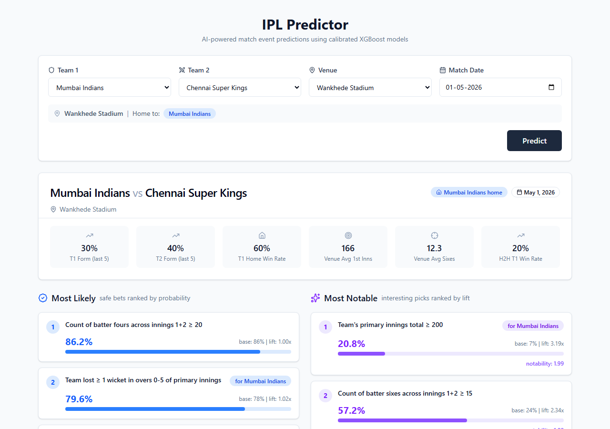
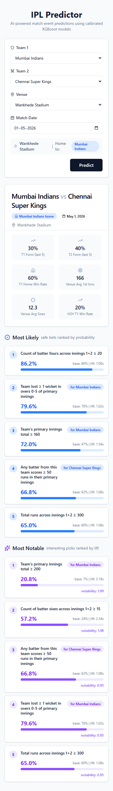
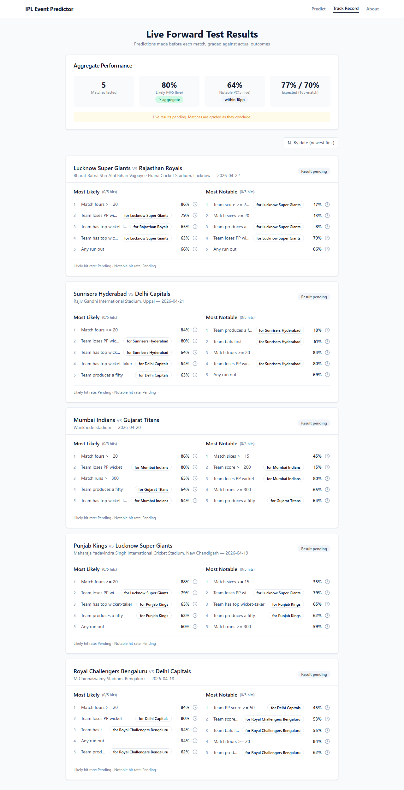
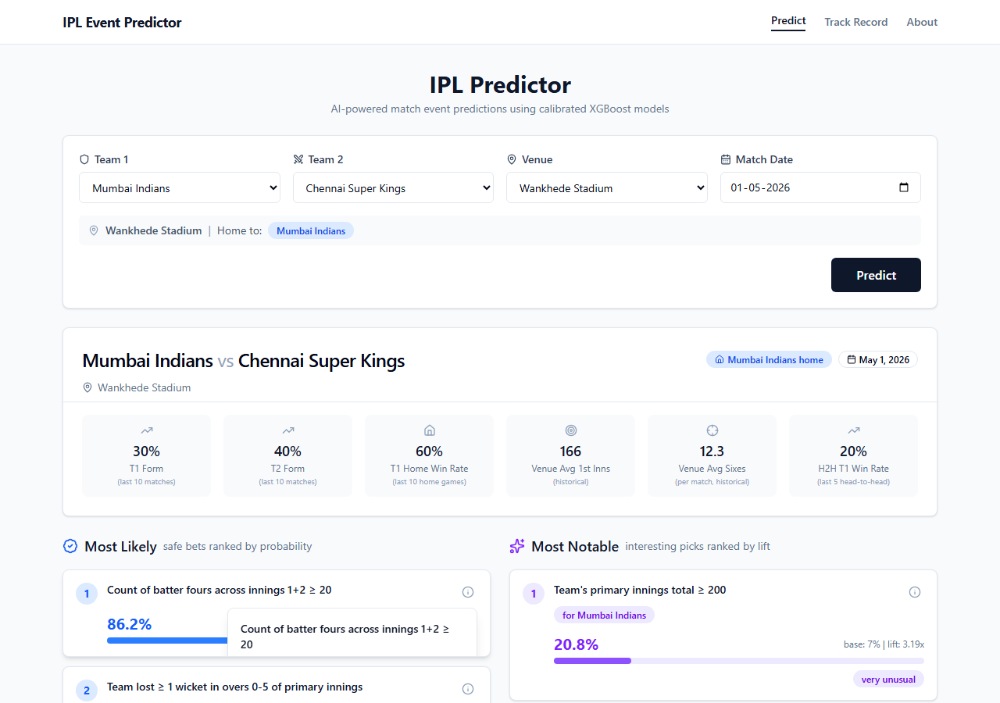
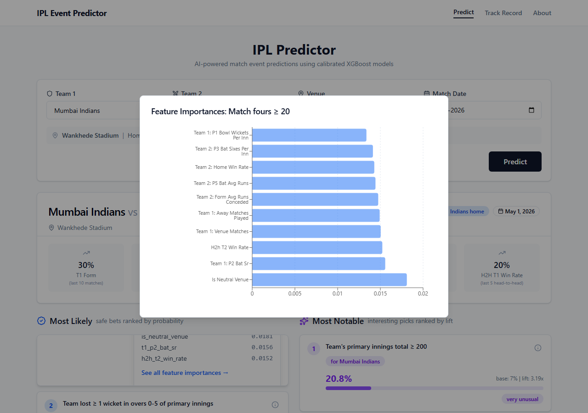
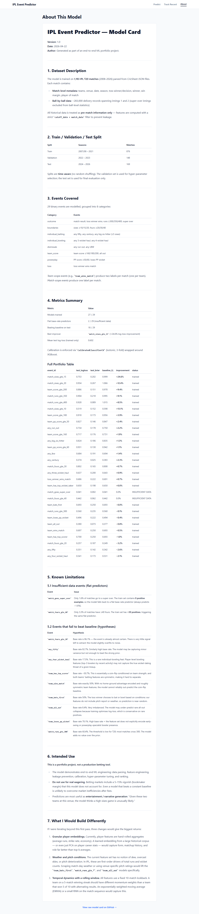

# PitchPulse — IPL Event Predictor

**AI-powered match event predictions for the Indian Premier League (IPL).**

PitchPulse is an end-to-end machine learning application that predicts 29 binary cricket events for any IPL fixture — from total runs and sixes to individual fifties, wicket hauls, and powerplay outcomes. It combines a calibrated XGBoost backend with a modern React frontend to deliver both "safe bet" and "notable upset" predictions.

> **Live Demo:** [https://pitchpulse.up.railway.app](https://pitchpulse.up.railway.app) *(update after deploy)*

---

## Screenshots

| Prediction Desktop | Prediction Mobile | Track Record |
|---|---|---|
|  |  |  |

| Explain Popover | Feature Importance | Model Card |
|---|---|---|
|  |  |  |

---

## Tech Stack

| Layer | Technology |
|-------|-----------|
| **Backend** | Python, FastAPI, Uvicorn |
| **ML** | XGBoost, scikit-learn (CalibratedClassifierCV), pandas, numpy |
| **Frontend** | React 19, TypeScript, Tailwind CSS 4, Vite |
| **Data** | CricSheet JSON → Parquet |
| **Deployment** | Railway (nixpacks) |

---

## Features

- **29 Predicted Events** across 8 categories:
  - Match outcomes (winner, toss winner wins, super over)
  - Boundaries (sixes ≥10/15/20, fours ≥20/30/40)
  - Individual batting (fifty, century, big six hitter ≥5)
  - Individual bowling (3-wicket, 4-wicket hauls)
  - Dismissals (run out, LBW)
  - Team scores (≥160/180/200, all out)
  - Powerplay (≥50/60, loses PP wicket)
  - Team-specific (has top scorer, has top wicket-taker)

- **Two Prediction Lists:**
  - **Most Likely** — highest probability events (safe bets)
  - **Most Notable** — events with the highest lift over historical base rate (context-sensitive upsets)

- **Diversity Ranking** — MMR (Maximal Marginal Relevance) ensures the top-5 covers different event categories instead of 5 similar predictions.

- **Explainable AI** — Click the ℹ️ icon on any prediction to see top driving features and a full feature importance chart.

- **Track Record** — Live forward-test results graded against actual match outcomes.

---

## Quick Start (Local)

### Prerequisites
- Python 3.11+
- Node.js 20+

### 1. Clone & setup Python environment

```bash
git clone https://github.com/hirensai111/PitchPulse.git
cd PitchPulse
python -m venv .venv
source .venv/bin/activate  # Windows: .venv\Scripts\activate
pip install -r requirements.txt
```

### 2. Start the backend

```bash
uvicorn api.main:app --reload --port 8000
```

### 3. Start the frontend (new terminal)

```bash
cd frontend
npm install
npm run dev
```

Open [http://localhost:5173](http://localhost:5173).

---

## API Endpoints

| Method | Endpoint | Description |
|--------|----------|-------------|
| GET | `/api/health` | Health check & model count |
| GET | `/api/teams` | Active IPL teams |
| GET | `/api/venues` | Venues with home team mapping |
| POST | `/api/predict` | Predict events for a match |
| GET | `/api/track-record` | Live forward test results |
| GET | `/api/event-importance/{event_id}` | Top 10 feature importances |
| GET | `/api/model-card` | Full model card (Markdown) |

### Example Predict Request

```bash
curl -X POST http://localhost:8000/api/predict \
  -H "Content-Type: application/json" \
  -d '{
    "team1": "Mumbai Indians",
    "team2": "Chennai Super Kings",
    "venue": "Wankhede Stadium",
    "match_date": "2026-05-01"
  }'
```

---

## Model Summary

- **Dataset:** 1,193 IPL matches (2008–2026), ~283,000 ball-by-ball records
- **Train / Val / Test:** 876 / 148 / 169 matches (time-aware, no shuffling)
- **Models:** 27 trained + 2 flat base-rate predictors (insufficient data)
- **Calibration:** Isotonic calibration with 3-fold stratified CV
- **Best Performer:** `match_sixes_gte_15` (+24.6% log-loss improvement)
- **Mean Test Log-Loss:** 0.602

See [`MODEL_CARD.md`](MODEL_CARD.md) for full details, limitations, and intended use.

---

## Project Structure

```
PitchPulse/
├── api/
│   ├── main.py              # FastAPI app
│   ├── test_endpoints.py    # pytest suite
│   └── data/
│       └── track_record.json
├── frontend/
│   ├── src/
│   │   ├── api/             # Axios client + React Query hooks
│   │   ├── components/      # UI components + shadcn primitives
│   │   ├── pages/           # Predict, TrackRecord, ModelCard
│   │   └── types/           # TypeScript interfaces
│   └── dist/                # Production build (committed for Railway)
├── src/
│   ├── parse_cricsheet.py   # JSON → Parquet
│   ├── events.py            # Event catalog & label computation
│   ├── features.py          # Feature engineering (leakage-safe)
│   ├── models.py            # Training & evaluation utilities
│   ├── predict_v2.py        # Prediction interface + MMR ranking
│   └── venue_mapping.py     # Venue → home team mapping
├── data/processed/          # Parquet files (committed for deployment)
├── models/                  # 29 trained .joblib models
├── docs/screenshots/        # UI screenshots
├── requirements.txt
├── Procfile
├── railway.toml
└── README.md
```

---

## Deployment (Railway)

1. Fork or push this repo to GitHub.
2. Create a new project on [Railway](https://railway.app).
3. Select **"Deploy from GitHub repo"** and choose `hirensai111/PitchPulse`.
4. Railway auto-detects Python via `requirements.txt` and uses the `Procfile` / `railway.toml`.
5. Once deployed, visit the generated domain.

### Environment Variables (optional)

| Variable | Purpose |
|----------|---------|
| `CORS_ORIGINS` | Comma-separated allowed origins (default: localhost only) |

---

## License

This is a portfolio project for educational and demonstration purposes. Not intended for production betting or wagering.

---

## Acknowledgements

- Match data from [CricSheet](https://cricsheet.org/)
- UI built with [Tailwind CSS](https://tailwindcss.com/) and [shadcn/ui](https://ui.shadcn.com/) patterns
